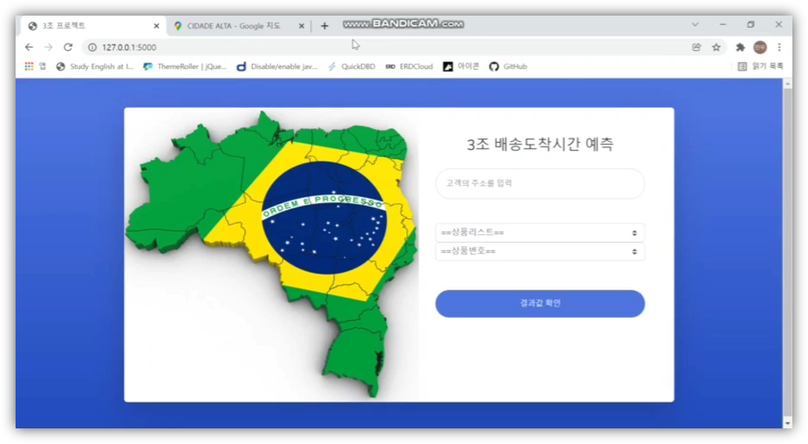
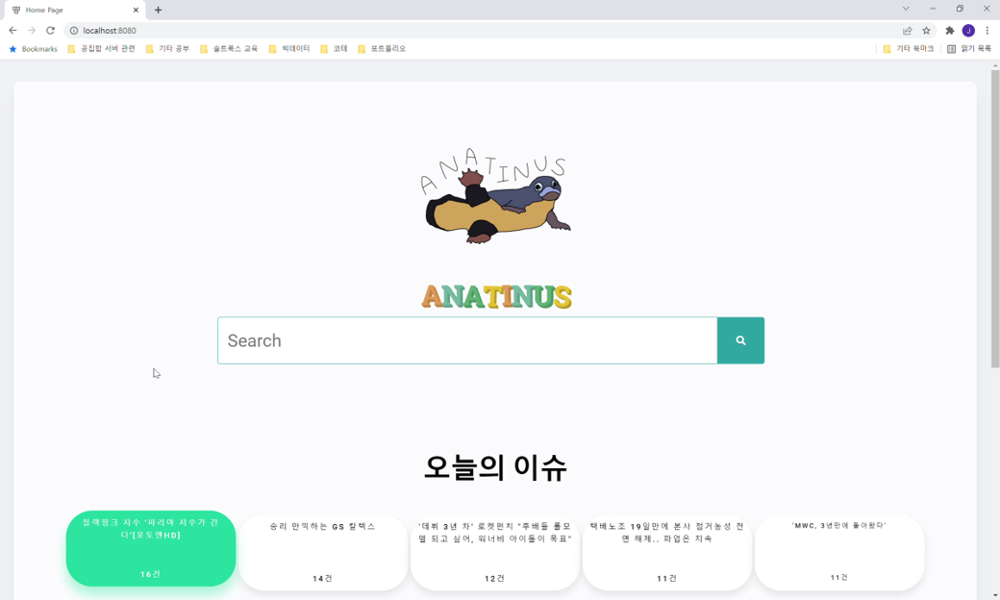

개인 포트폴리오 사이트 : [https://kkh9198.github.io/] 
Python / SQL / Pandas / Numpy / Sklearn / R 
데이터 수집, EDA, 머신러닝 등을 활용한 예측 프로젝트를 진행한 경험이 있습니다😊. 
🙌잘부탁드립니다🙌 

<데이터 분석가를 목표로 공부하고 있습니다!!!>

진행 프로젝트 
1.브라질 E-commerce Olist 배송기간 예측 프로젝트 

개요 : 브라질 E-commerce의 유니콘 기업인 Olist의 주문 데이터를 활용해 다양한 인사이트를 발굴하여 배송기간에 유의미한 변수를 추가하고, 이를 활용해 배송기간을 예측하여 고객에게 서비스를 제공합니다. 

바로가기[https://github.com/kkh9198/Olist_delivery_predict.git]

2.뉴스 데이터 자연어 처리를 통한 트렌드 분석 및 검색 서비스

개요 및 배경 : 구글과 네이버는 최근 AI를 활용한 검색엔진구축에 힘쓰고있습니다. 본 프로젝트에서는 수집된 뉴스데이터를 엘라스틱 서치를 활용한 인덱스 조회 방식으로 빠르게 문서에 접근합니다. 그리고 뉴스 주제 군집화, 카테고리 분류 모델을 통해 다양한 시각화와 워드클라우드 등 대시보드를 제공합니다.

바로가기[https://github.com/kkh9198/Final_Project.git]
